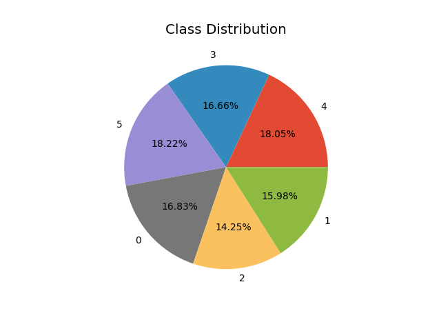
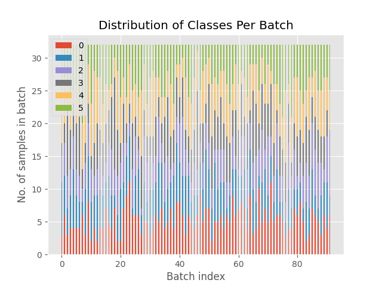
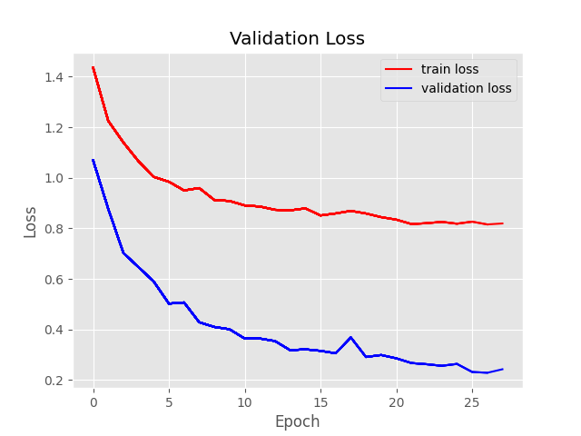
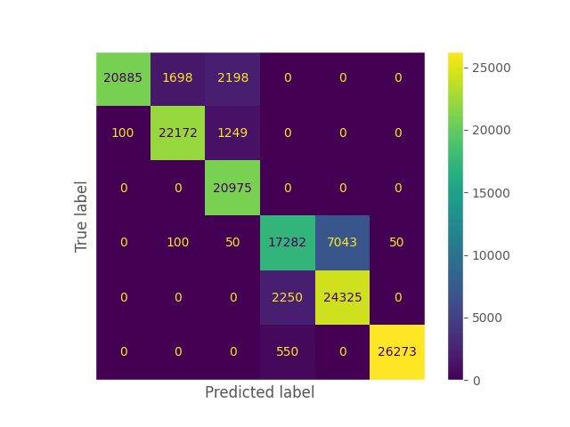

MY CONTRIBUTIONS TO https://github.umn.edu/IRVLab/anomaly_detection

# Anomaly Detection
## Load Models 
| Model Name  | Model Class | Model Overview | Refrence |
| ------------- | ------------- | ------------- | ------------- |
| cnn  | Deep Learning | 2x 1D Convultional Blocks | Zheng, Y., Liu, Q., Chen, E., Ge, Y., Zhao, J.L. (2014). Time Series Classification Using Multi-Channels Deep Convolutional Neural Networks. In: Li, F., Li, G., Hwang, Sw., Yao, B., Zhang, Z. (eds) Web-Age Information Management. WAIM 2014. Lecture Notes in Computer Science, vol 8485. Springer, Cham. https://doi.org/10.1007/978-3-319-08010-9_33  |
| cnn_dw | Deep Learning | Concatenated output of convultional and lstm block is fed to a multi-layer perceptron | Fazle Karim, Somshubra Majumdar, Houshang Darabi, Samuel Harford, Multivariate LSTM-FCNs for time series classification, Neural Networks, Volume 116, 2019, Pages 237-245, ISSN 0893-6080, https://doi.org/10.1016/j.neunet.2019.04.014  |
| cnn_lw | Deep Learning | output of convultional block is fed to lstm block | R. Mutegeki and D. S. Han, "A CNN-LSTM Approach to Human Activity Recognition," 2020 International Conference on Artificial Intelligence in Information and Communication (ICAIIC), Fukuoka, Japan, 2020, pp. 362-366, doi: 10.1109/ICAIIC48513.2020.9065078.  |
| attention | Deep Learning | output of multi-headed self-attention encoder block is fed to mutli layer perceptron| George Zerveas, Srideepika Jayaraman, Dhaval Patel, Anuradha Bhamidipaty, and Carsten Eickhoff. 2021. A Transformer-based Framework for Multivariate Time Series Representation Learning. In Proceedings of the 27th ACM SIGKDD Conference on Knowledge Discovery & Data Mining (KDD '21). Association for Computing Machinery, New York, NY, USA, 2114–2124. https://doi.org/10.1145/3447548.3467401  |
| tsf | Traditional Machine Learning | ensemble of descision trees | Deng, Houtao, George Runger, Eugene Tuv, and Martyanov Vladimir. "A time series forest for classification and feature extraction." Information Sciences 239 (2013): 142-153.  |


### Configuration 
task – default is "classification." For attention-based model, setting task to "imputation" will generate a state dictionary through unsupervised pretraining and use to initalize the weights to perform classification using the attention model.

log - enable the creation of a log file that notes hyperparamters, dataset, loss, and final accuracy for each model.  

plots – enable model visualization.

debug – enbale output of model weight dimnesions. 

device – specificy identify of gpu (if available) and number of workers for multiprocessing (if set to 0, multiprocessing is disabled). 

model hyperparameters (such as number of filters, hidden layer nodes, etc.) can be set in the conf/ directory. 

### Visualization

If plotting is enabled, the following visualizations will be generated. 

1 – Distribution of classes within the dataset, to facilitate spot-checks for unbalanced data. 


2 – Distirbution of classes in each batch (generated by the PyTorch Dataloader class)


3 – Loss graph over the course of training. Loss is calculated from the validation set.  


4 – Confusion matrix calculated based on the test data. 



Dataset and model visualizations will be saved in the following file structure.  

```
plots/
    ├── <dataset_name>/
        ├── confusion_matrix/
            ├── <model_name>/
                ├── <task>/
                    └── cm.png (confusion matrix)
            ├── ...
        ├── dataset_summary/
            ├── <model_name>/
                ├── train_dataloader.png (per batch class distribution – to check for unbalanced datasets)
                └── train_dataloader.png 
            ├── ...
            ├── test_data_classprop.png (proportion of each class in the dataset – to check for unbalanced datasets)
            ├── test_data_classstats.png 
            ├── train_data_classprop.png 
            └── train_data_classprop.png 
        ├── loss_train_valid/
            ├── <model_name>/
                ├── <task>/
                    └── loss_graph.png 
    ├── ...
    
```


